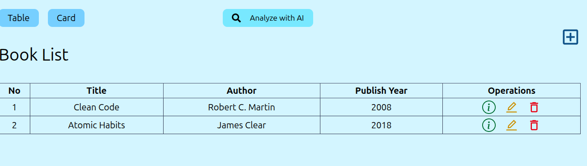
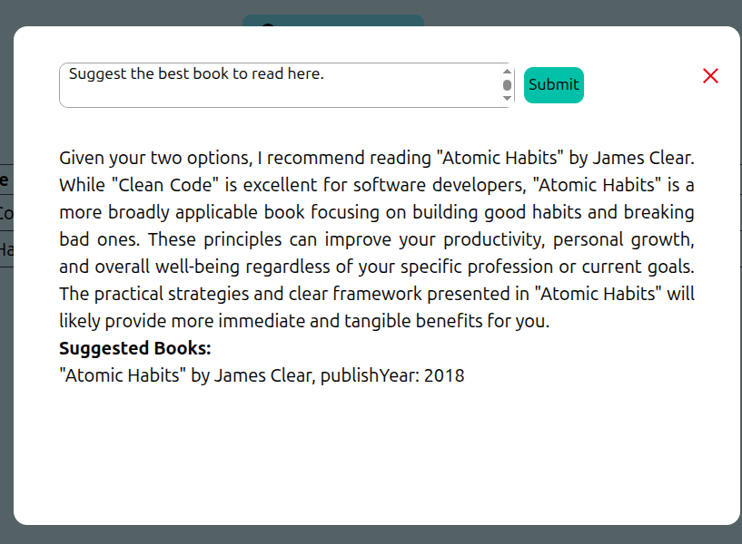

# 📚 IntelliLibrary

**IntelliLibrary** is a full-stack web application built with **React** (Vite + Tailwind CSS) on the frontend and **Express.js** on the backend. It allows users to create, read, update, and delete (CRUD) book records, making it ideal for managing small library systems.

---

## 🗂 Project Structure

```
IntelliLibrary/
├── Client-Side/         # Frontend (React + Vite + Tailwind)
└── Server-Side/         # Backend (Express.js + MongoDB)
```

---

## 🚀 Features

- 📘 Add, edit, view, and delete books
- 🔍 Search for books
- 📦 Responsive UI with Tailwind CSS
- 🧩 Modular component-based structure
- ⚡ Fast dev experience with Vite

---

## 🖼️ Screenshots

### 📋 Book List Page



### 🤖 Analyze with AI Page

- Gemini api analyzed the files inside the database, and answered users questions by suggesting appropriate book.



---

## 🛠️ Tech Stack

- **Frontend**: React, Vite, Tailwind CSS
- **Backend**: Node.js, Express.js, Gemini API
- **Database**: MongoDB (Mongoose)
- **Other**: REST API, Axios

---

## 📦 Installation

> 📝 Ensure you have **Node.js**, **npm**, and **MongoDB** installed.

### 1. Clone the Repository

```bash
git clone https://github.com/TarequeMahmud/IntelliLibrary.git
cd IntelliLibrary
```

---

### 2. Setup the Server (Backend)

```bash
cd Server-Side
npm install
```

Start the server:

```bash
npm start
```

---

### 3. Setup the Client (Frontend)

Open a new terminal and run:

```bash
cd Client-Side
npm install
npm run dev
```

This will launch the frontend at [http://localhost:5173](http://localhost:5173)

---

## 🔗 API Endpoints

| Method | Endpoint       | Description     |
| ------ | -------------- | --------------- |
| GET    | /api/books     | Get all books   |
| GET    | /api/books/:id | Get single book |
| POST   | /api/books     | Add new book    |
| PUT    | /api/books/:id | Update book     |
| DELETE | /api/books/:id | Delete book     |

---

## 🖼️ Screenshots

> (Add screenshots of Home, Book View, Edit Book etc.)

---

## 🤝 Contributing

Pull requests are welcome! For major changes, please open an issue first to discuss the proposal.

---

## 📄 License

MIT License

---

## 👤 Author

- **Your Name** — [@Tareque Mahmud](https://github.com/TarequeMahmud)

---

## 📬 Contact

If you like this project, feel free to reach out or leave a ⭐ on the repository!
